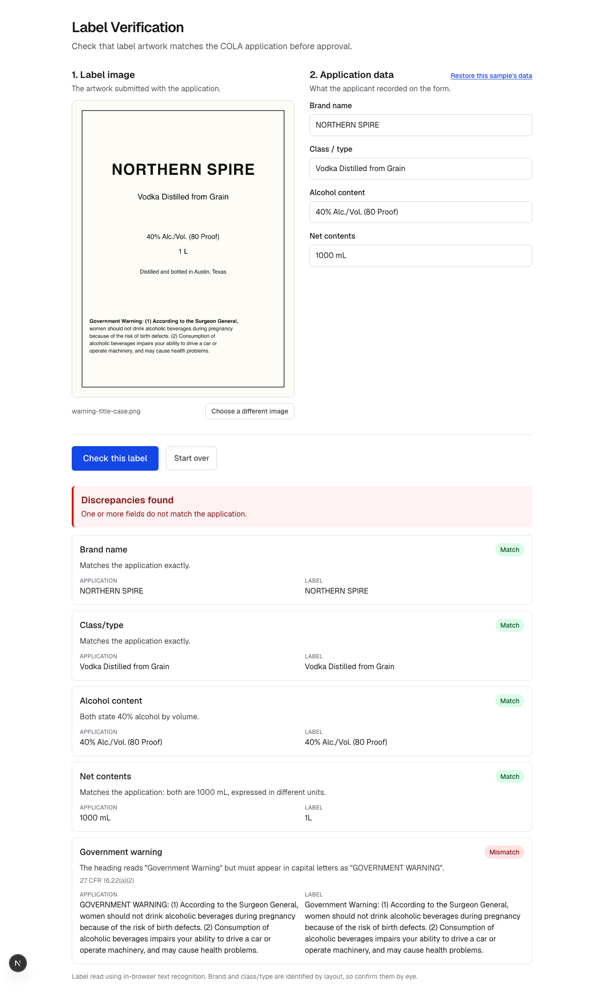

# Label Verification

Checks alcohol beverage label artwork against the data submitted in a COLA
application, and shows a compliance agent field by field where the two disagree.

Built for the TTB take-home exercise. The brief is in
[`docs/ASSIGNMENT.md`](docs/ASSIGNMENT.md).

**Live demo:** https://take-home-oa-treasury.vercel.app

No sign-in, no configuration, nothing to install. The label is read in the
browser, so the deployment holds no keys and stores nothing.



## Try it in one minute

1. Open the app.
2. Press **Fill with sample values** to populate the application fields.
3. Drop in one of the sample labels from [`public/samples`](public/samples):

| Sample | What it demonstrates |
| --- | --- |
| `compliant.png` | Everything agrees. Verifies clean. |
| `brand-case.png` | Brand differs only in capitalization. Still passes. |
| `warning-title-case.png` | Warning heading in title case. Rejected, citing 16.22(a)(2). |
| `alcohol-mismatch.png` | Label says 40%, application says 45%. |
| `proof-contradiction.png` | Label states 45% and 80 proof, which cannot both be true. |
| `missing-warning.png` | No health warning at all. |

## Setup

Requires Node.js 20 or newer.

```bash
npm install
npm run dev
```

The app runs at http://localhost:3000 with no configuration. A vision model is
optional; see [Label reading](#label-reading) below.

| Command | Purpose |
| --- | --- |
| `npm run dev` | Start the dev server |
| `npm run build` | Production build |
| `npm test` | Unit tests |
| `npm run test:e2e` | Runs real OCR over the sample labels |
| `npm run labels` | Regenerate the sample label images |
| `npm run lint` | Lint |

`npm run test:e2e` is separate because it downloads Tesseract language data on
first run, which is slow and needs network access.

## Approach

Verification runs in two independent stages.

**Extraction** turns the label image into text fields. **Comparison** checks
each field against the application. Keeping them apart means the comparison
rules are pure functions that can be tested exhaustively without images or
network calls, and the label reader can be swapped without touching them.

### Comparison

The interviews pushed hard in two directions at once. Dave wanted judgement,
because `STONE'S THROW` and `Stone's Throw` are obviously the same brand. Jenny
wanted strictness, because a warning in title case is a rejection. A single
similarity score cannot serve both, so each field carries its own rule.

Checks resolve to one of four states rather than passing or failing:

| State | Meaning |
| --- | --- |
| `match` | The values agree. |
| `review` | Close, but a person should decide. |
| `mismatch` | A definite discrepancy. |
| `missing` | Could not be read, or was left blank. |

Only a `mismatch` fails an application. `review` and `missing` route to an
agent. The tool narrows what a human looks at; it does not reject on its own
authority.

Per field:

- **Brand name** and **class/type** are compared after folding away casing,
  accents, and typographic characters, then by edit distance. `Whiskey` against
  `Whisky` scores 97% and is flagged for review rather than rejected.
- **Alcohol content** is parsed numerically, so `45% Alc./Vol. (90 Proof)`
  matches a recorded `45`. A stated proof is also checked against the stated
  percentage, which catches a label claiming 45% and 80 proof.
- **Net contents** is converted to millilitres, so `1 L` equals `1000 mL`.
- **Government warning** is held to the verbatim text of 27 CFR 16.21 rather
  than to a threshold. Altered wording is reported with the specific word that
  differs, and the heading is checked for capitals under 16.22(a)(2). Case is
  enforced only on the heading, since that is all the regulation requires.

Two rules come from the regulation rather than the brief. 16.22(a)(2) also
forbids the remainder of the warning from being bold, so the check accepts
formatting flags when the reader can report them. And a proof figure that
contradicts its own percentage is a defect regardless of what the application
says.

### Label reading

Text recognition runs **in the browser**. That decision follows from the
constraints rather than from preference:

- The image never leaves the agent's machine, so there is nothing to store and
  no document retention question for a prototype.
- Nothing needs to be configured for the deployment to work, so the demo cannot
  break because a key expired or a quota ran out.
- Neither the request body limit nor the function timeout of the hosting tier
  applies, since no image is uploaded.

A vision model is the better reader and remains the preferred path. When
`GEMINI_API_KEY` is set, the app sends the image to `/api/extract` and uses the
model's transcription; if the provider is unreachable or out of quota it falls
back to local recognition automatically. Copy `.env.example` to `.env.local` and
add a key from [Google AI Studio](https://aistudio.google.com/apikey) to enable
it.

Images are downscaled in the browser before recognition, which is the single
largest factor in staying inside the five-second budget the interviews set.

## Tools

| Concern | Choice | Why |
| --- | --- | --- |
| Framework | Next.js 16, App Router | UI and API in one deployable codebase |
| Language | TypeScript | Rules engine benefits from a typed domain model |
| UI | React 19, Tailwind CSS v4 | |
| Text recognition | tesseract.js | Runs client-side, no key, no per-request cost |
| Vision model | Gemini Flash-Lite, optional | Highest free-tier request allowance |
| Tests | Vitest | |
| Sample labels | Generated from SVG with sharp | Reproducible and version-controlled |

Comparison uses no third-party string library; the edit distance is about
twenty lines and avoids a dependency for one function.

## Assumptions

The brief leaves several things open. Rather than ask, these were decided and
recorded here.

- **Distilled spirits are assumed.** All five fields are checked on every label.
  Alcohol content is optional for some wines and malt beverages under TTB rules;
  that exemption is not implemented.
- **The application data is typed in by hand.** There is no COLA integration, so
  the form stands in for the submitted record.
- **Nothing is stored.** No image, application, or result is persisted. This
  keeps the prototype clear of the PII and retention questions raised in the
  interviews.
- **One label image per application.** Front and back labels are not combined.
- **A near match is never auto-approved.** Anything short of an exact match after
  normalization is surfaced to an agent.
- **Statutory alcohol tolerances are not applied.** The figures are expected to
  agree; TTB permits small deviations that this prototype does not model.

## Limitations

- **Brand and class/type are the weakest reads.** Neither has a distinguishing
  pattern, so the parser relies on layout, treating the tallest line as the
  brand. A stylized or split brand name can defeat this. The UI says so when
  local recognition was used.
- **Type size and legibility are not checked.** 16.22(b) specifies minimum
  millimetre heights, which cannot be derived from an image without knowing the
  physical container size.
- **Bold type is only checked when a vision model reports it.** Local OCR does
  not expose font weight, so the bold requirements of 16.22(a)(2) go unverified
  on that path.
- **Angled and low-light photographs degrade badly under local OCR.** This is the
  case Jenny raised, and it is the strongest argument for the vision path.
- **English only.**
- **Batch upload is not implemented.** The extraction interface takes one image
  at a time; batching would be a queue around it rather than a change to it.

## Layout

```
app/                     routes and the page shell
  api/extract/           vision extraction endpoint
components/              UI
lib/
  verification/          comparison rules, no I/O
  extraction/            reading a label into fields
scripts/                 sample label generation
public/samples/          generated test labels
docs/ASSIGNMENT.md       the original brief
```

## Testing

Unit tests cover the comparison rules, including the specific cases the
interviews described, plus OCR field parsing and the vision request and response
shapes. The end-to-end suite runs real recognition over the six sample labels
and asserts the resulting verdicts, which is what caught Tesseract skipping the
brand name under its default page segmentation mode.
